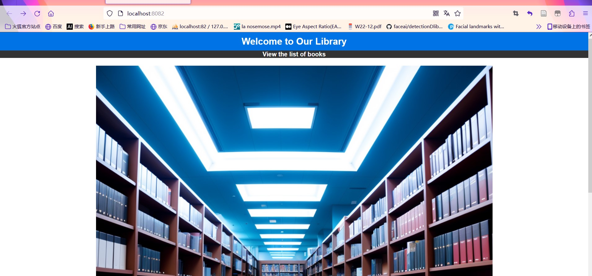
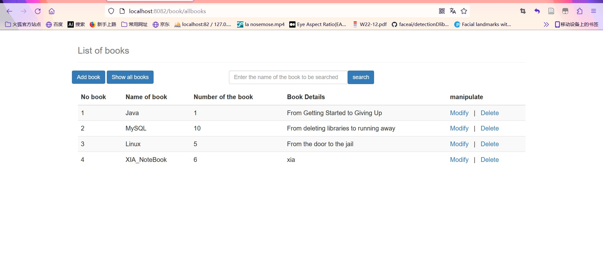
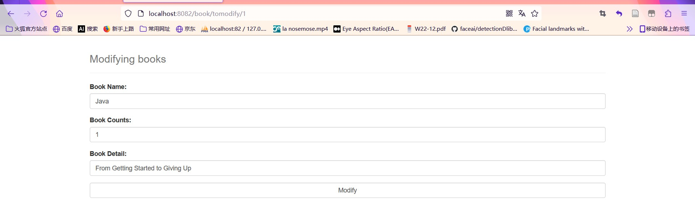

## Using SSM architecture to realize systematic addition, deletion and retrieval of books

Simple page display (the purpose of the project is mainly to familiarize with the SSM framework)

Future plans: do some small exercises using SpringBoot, plus continue this project using the React framework(font end).